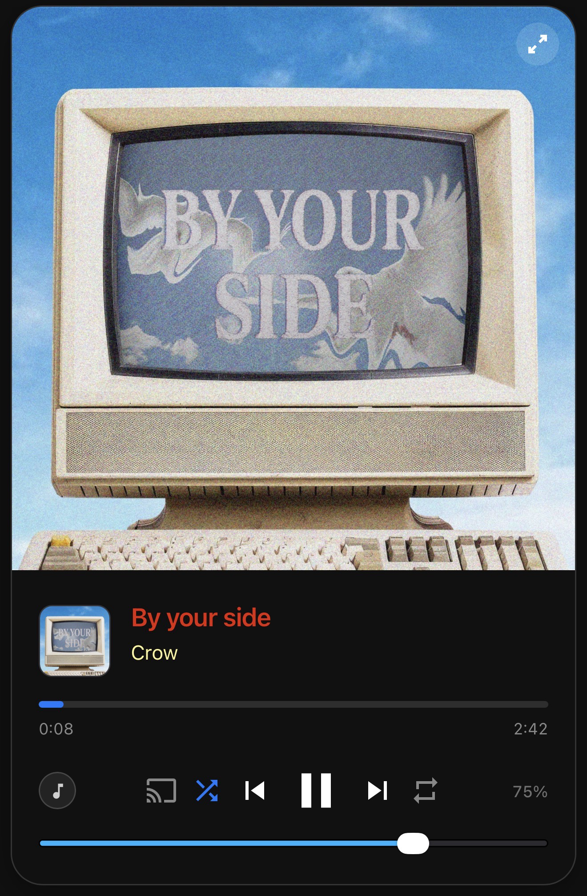
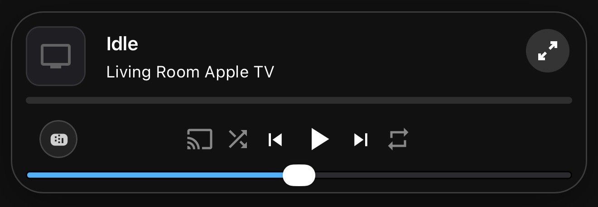
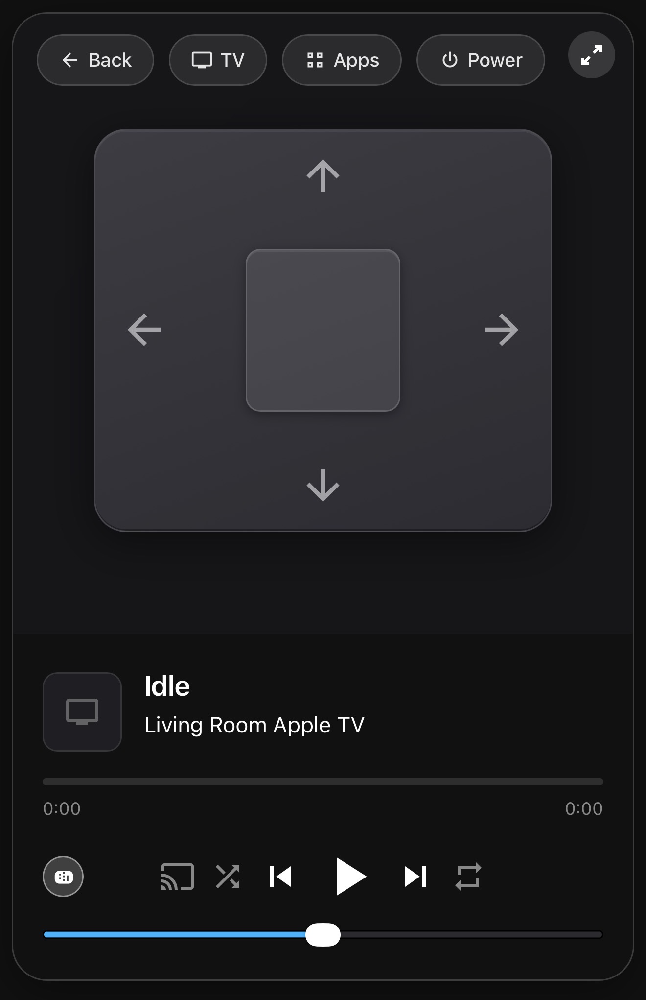
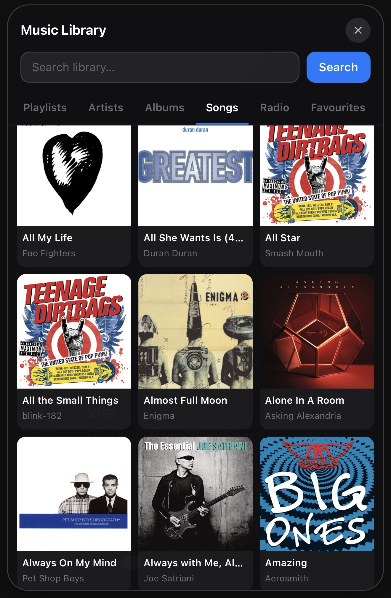

# ATV Media Remote

A sleek, Apple-inspired custom media player card for Home Assistant with a built-in Apple TV remote control, smart volume handling, multi-device switching, and a fully visual editor. No YAML required.

[](https://my.home-assistant.io/redirect/hacs_repository/?owner=jamesmcginnis&repository=atv-media-remote&category=dashboard)

<p align="center">
  
  
  
</p>

-----

## What It Does

**ATV Media Remote** replaces the default media player card with something that actually feels good to use. In compact mode it sits as a slim strip in your dashboard. Tap to expand and you get full album art, a seekable progress bar, shuffle, repeat, and volume control. Tap the remote icon and the album art gives way to an Apple Remote-style touchpad — Back, TV, an App launcher, Power, and full directional navigation — all without leaving the card.

The card remembers how you like it. Set your preferred startup view — compact, maximised, or remote control — and it opens that way every time you navigate to the page.

-----

## Features

- **Three view modes** — compact strip, full expanded view, and Apple TV remote overlay
- **Configurable startup view** — always opens in compact, maximised, or remote mode
- **Apple TV remote** — touchpad navigation, Back, TV home, Apps launcher, and Power with live on/off indicator
- **App launcher** — tap Apps to see all installed apps and launch any of them instantly
- **Smart volume** — detects Apple TV automatically and uses remote commands for reliable volume in every app; falls back to standard volume control for other players
- **Volume slider or buttons** — choose a full-width drag slider or flanking + / − buttons
- **Mini remote shortcut** — one tap in compact mode jumps straight into the remote view
- **Multi-device switching** — manage multiple media players with drag-to-reorder and auto-switch
- **Live progress bar** — second-by-second updates, tap anywhere to seek
- **Full colour customisation** — individual pickers for accent, volume, title, and artist
- **Visual editor** — no YAML needed

-----

## Visual Editor

<p align="center">
  
</p>

The visual editor covers everything — colour pickers for accent, volume, title and artist text, toggle switches for auto-switch, entity selector visibility, and volume button mode, a startup view selector, and a searchable drag-and-drop entity list.

-----

## Volume on Apple TV

Most Apple TV apps — YouTube, Infuse, Plex, Netflix, Disney+ and others — manage their own audio pipeline and ignore `media_player.volume_set`. This card detects when a `remote.*` entity is present and automatically switches to sending `remote.send_command` volume steps instead. Volume works reliably across every app with no configuration needed.

-----

## Startup View

Set your preferred startup view in the visual editor and the card always opens in that state when you navigate to the page or reload the app. Changing the setting takes effect immediately — no page reload required.

-----

## Quick Setup

1. Open HACS and click **Frontend**
1. Click the three dots menu and select **Custom repositories**
1. Add `https://github.com/jamesmcginnis/atv-media-remote` with category **Dashboard**
1. Click **Install** and restart Home Assistant
1. Add the card to any dashboard and configure in the visual editor

For full Apple TV support, ensure the Home Assistant [Apple TV integration](https://www.home-assistant.io/integrations/apple_tv/) is installed — it creates the `remote.*` entity the card needs automatically.

-----

## Configuration

```yaml
type: custom:atv-media-remote
entities:
  - media_player.apple_tv_living_room
  - media_player.bedroom_speaker
accent_color: "#007AFF"
volume_accent: "#007AFF"
title_color: "#ffffff"
artist_color: "#ffffff"
auto_switch: true
show_entity_selector: true
volume_control: slider
startup_mode: compact
```

|Option                |Default  |Description                                    |
|----------------------|---------|-----------------------------------------------|
|`entities`            |required |One or more `media_player` entity IDs          |
|`accent_color`        |`#007AFF`|Progress bar and active icon colour            |
|`volume_accent`       |`#007AFF`|Volume slider colour                           |
|`title_color`         |`#ffffff`|Song title text colour                         |
|`artist_color`        |`#ffffff`|Artist name text colour                        |
|`auto_switch`         |`true`   |Switch to whichever entity is currently playing|
|`show_entity_selector`|`true`   |Show entity picker in expanded view            |
|`volume_control`      |`slider` |`slider` or `buttons`                          |
|`startup_mode`        |`compact`|`compact`, `maximised`, or `remote`            |