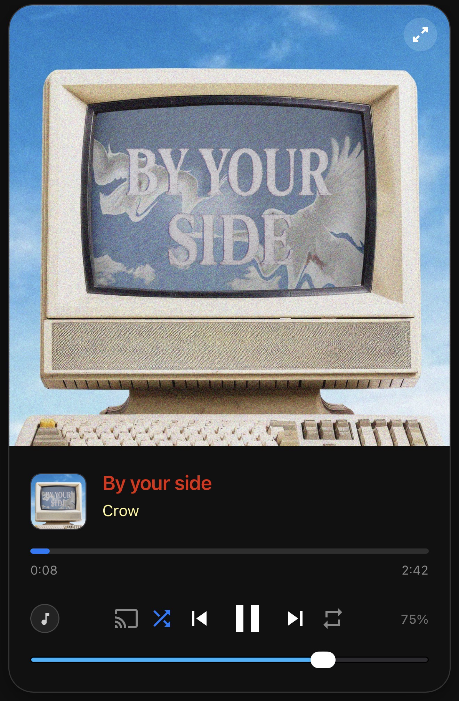
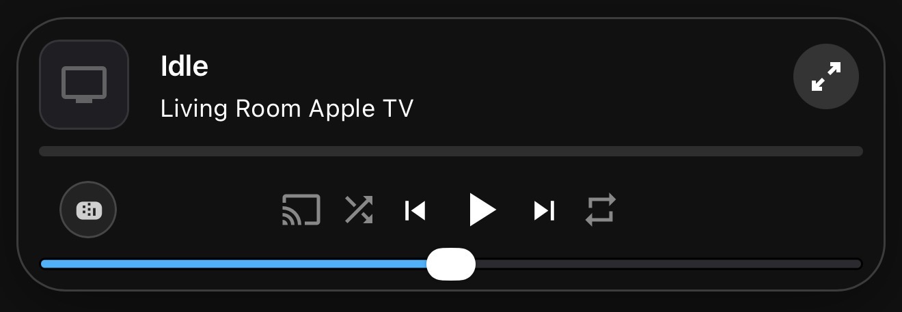
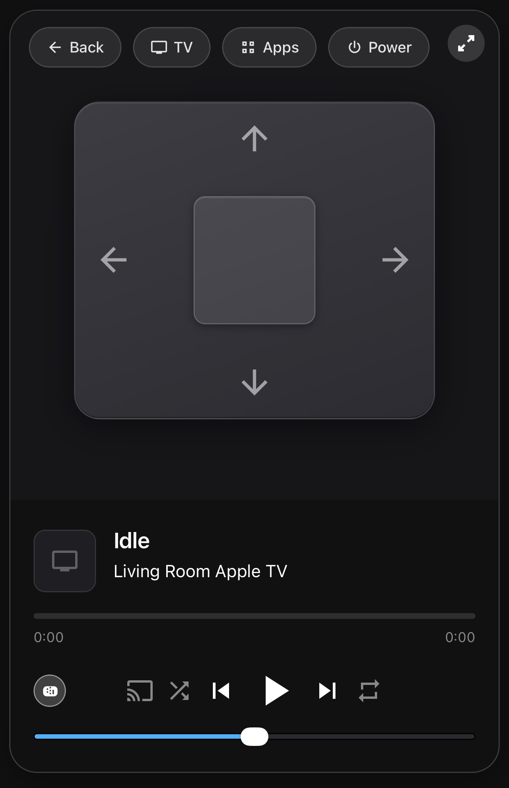
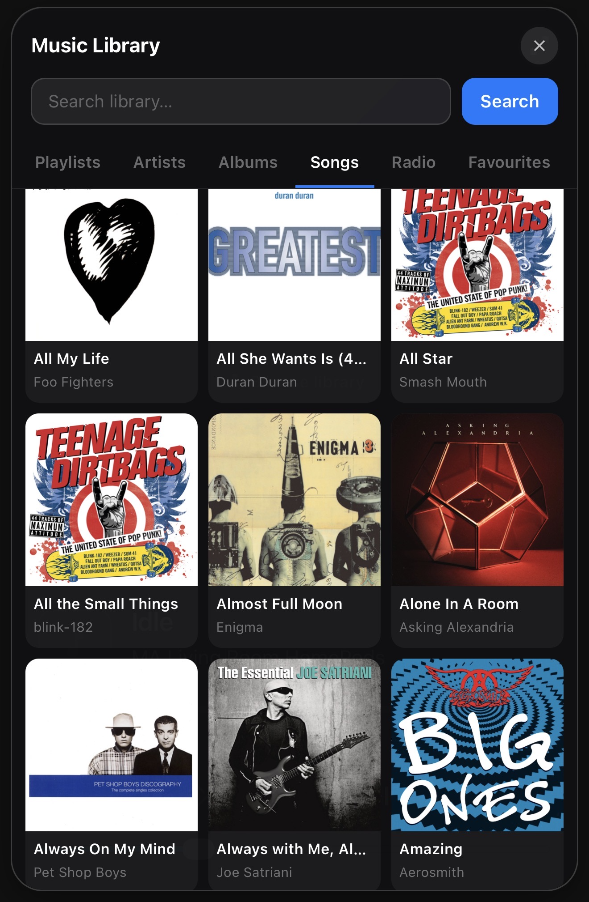
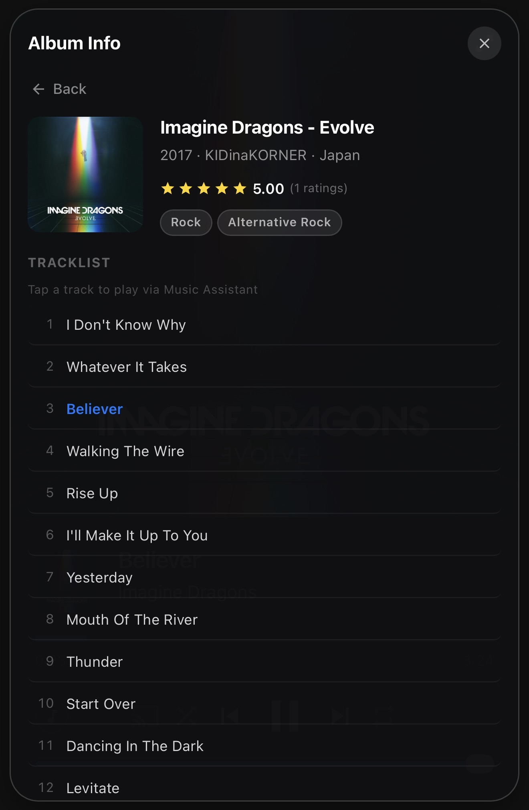
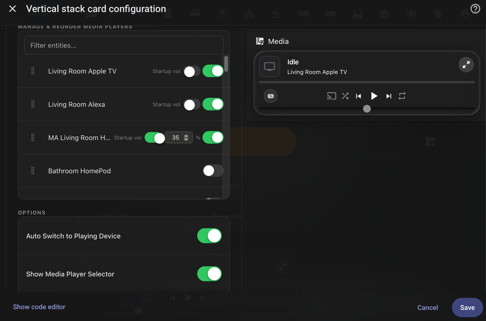
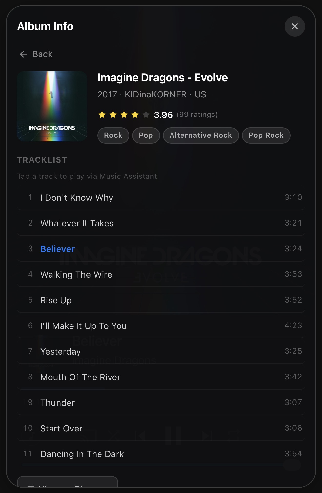
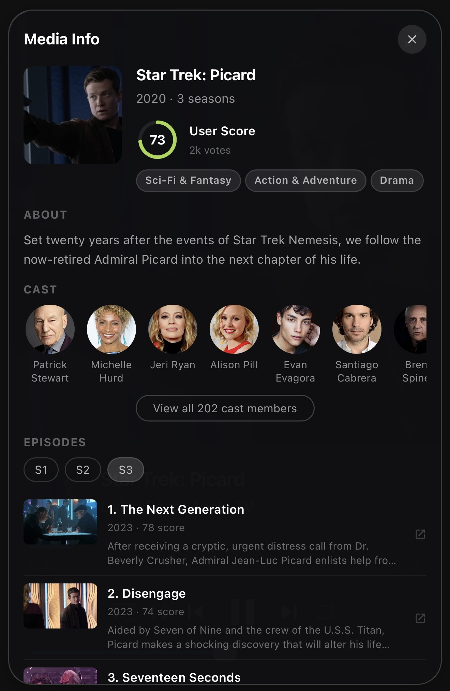

# ATV Media Remote

A beautiful, Apple-inspired media player card for Home Assistant with seamless device switching, Music Assistant integration, Apple TV remote control, rich media info panels, and a sleek dark interface. Optimised for iPhone Dashboards.

















## Key Features

- **Apple-inspired Design** — sleek dark frosted-glass theme with rounded corners, smooth animations and customisable accent colours
- **Tactile Button Feedback** — prominent glow and blur effects when buttons are pressed, on desktop and mobile
- **Automatic Device Switching** — card automatically follows whichever media player starts playing
- **Compact and Expanded Modes** — toggle between full album art and a space-saving mini player with a single tap
- **Full Media Controls** — play/pause, track navigation, shuffle, repeat, seek, and mute
- **Mute Toggle** — tap the volume percentage badge or speaker icon to instantly mute/unmute any player
- **Live Progress Tracking** — real-time playback position updates every second without extra polling
- **Multi-Device Management** — control multiple media players from a single card with easy device switching
- **Volume Control** — slider or +/− buttons, with optional routing to a separate volume entity
- **Album Artwork** — displays album art with automatic fallback to device icons when artwork fails to load
- **Long Press for More Info** — long press the album artwork or fallback icon (expanded mode) to open the Home Assistant more-info dialog for the active entity; works on iPhone too
- **Mobile Optimised** — touch-friendly interface designed for iPhone dashboards

## Media Info Panels

Tap any album artwork or video poster to open a full media info panel:

- **Music (Discogs)** — fetches the full release record including tracklist, label, year, country, formats, genres and a community star rating. When a match is ambiguous a release picker is shown with artwork and pressing details so you can choose the correct one. A ← Back button lets you return to the picker and try a different release without re-fetching. No API key required.
- **Play from tracklist (Music Assistant)** — when a Music Assistant speaker is active, every track in the Discogs panel shows a ▶ play hint. Tap any track to open a confirmation dialog showing the track title, artist and target speaker. Tap **Play** to search your MA library and start the track immediately; tap **Cancel** to go back. On success the panel confirms "✓ Playing now" and closes. On non-MA speakers, tracks link to Discogs instead.
- **TV & Movies (TMDB)** — fetches cast, overview, poster and ratings. When a title matches both a TV series and a movie, an interactive picker with colour-coded badges lets you choose. A ← Back button lets you return to the picker and try a different result without re-fetching. Requires a free TMDB v3 API key.

## Mute Toggle

Tap the **volume percentage badge** or the **speaker icon** to mute or unmute. Tap again to restore the previous volume level.

- **Modern Alexa, Sonos, Chromecast** — uses the native HA `volume_mute` service
- **Apple TV, HomePod, Music Assistant speakers** — soft-mute (sets volume to 0 and restores on unmute)
- **Older Alexa models** — some older Echo devices may not respond to mute commands; this is a known device limitation

## Apple TV Remote Control

- Built-in remote overlay with directional pad, Select, Back, Home, Apps and Power buttons
- Apps button opens a live dropdown of all sources and apps on your Apple TV
- Remote is automatically shown only for Apple TV players and hidden for everything else

## Music Assistant Integration

- Automatically detected via the Home Assistant entity registry — no manual configuration needed
- Built-in library browser with tabs for Playlists, Artists, Albums, Tracks, Radio, Favourites and Search
- Tap any item to start playback immediately on the selected speaker
- In compact mode, tapping the browse button automatically expands the card first

### Playing from Album Art

While a track is playing on an MA speaker, tap the album artwork to open the Discogs media info panel. Tracks played from the panel start immediately, replacing the current queue. The full tracklist is shown with ▶ play hints on every row. Tap a track to open a confirmation dialog — it shows the track title, artist and which speaker it will play on. Tap **Play** to start it via Music Assistant, or **Cancel** to go back and choose another track. This lets you browse an album and pick any track without leaving your dashboard.

### When Nothing is Playing

When an MA speaker is idle or paused, the artwork area shows a music note icon with a **Browse library** hint. Tap it to open the MA library browser directly and start something new.

## Volume & Startup

- **Per-entity startup volumes** — automatically set each speaker to a specific volume when a new track begins; configure individual levels directly in the visual editor entity list
- **Safe volume handling** — volume commands are only sent to devices that support them, preventing errors on Apple TV and similar devices

## Smart Device Detection

- **Apple TV** (`device_class: tv`) — remote button shown
- **HomePod** (`device_class: speaker`) — remote hidden
- **Music Assistant** (`platform: music_assistant`) — MA browse button shown, remote hidden
- **Alexa / all others** — remote hidden, standard controls shown

If a Music Assistant speaker isn't being recognised automatically, add its entity ID to `ma_entities` in your YAML as a manual override.

## Visual Configuration Editor

Full visual editor — no YAML required:

- Entity list with search/filter and drag-and-drop reordering; tick a speaker to reveal its individual startup volume input
- Colour picker tiles for accent, volume, title, artist, button, volume % and background — each shows a large clickable swatch with the hex value beneath; click the swatch to open the native picker or type directly into the hex field
- Background colour supports `#000000` as a shortcut for fully transparent, or 8-digit hex (e.g. `#1c1c1e80`) for partial opacity
- Toggles for auto-switch, remember last entity, entity selector, volume buttons, volume percentage and text scrolling
- Startup mode selector (compact / maximised / remote)
- Volume entity routing to a separate device
- TMDB API key input for TV and movie lookups

## Quick Start

```yaml
type: custom:atv-media-remote
entities:
  - media_player.living_room_apple_tv
  - media_player.living_room_homepod
  - media_player.kitchen_alexa
  - media_player.mass_living_room
accent_color: '#007AFF'
entity_startup_volumes:
  media_player.living_room_homepod: 25
  media_player.kitchen_alexa: 40
# Optional: force MA mode for entities that fail auto-detection
ma_entities:
  - media_player.my_ma_speaker
```

All settings can be configured through the built-in visual editor — no YAML editing required!

## Credits

The Music Assistant library browser includes code adapted from [yet-another-media-player](https://github.com/jianyu-li/yet-another-media-player) by [@jianyu-li](https://github.com/jianyu-li).
